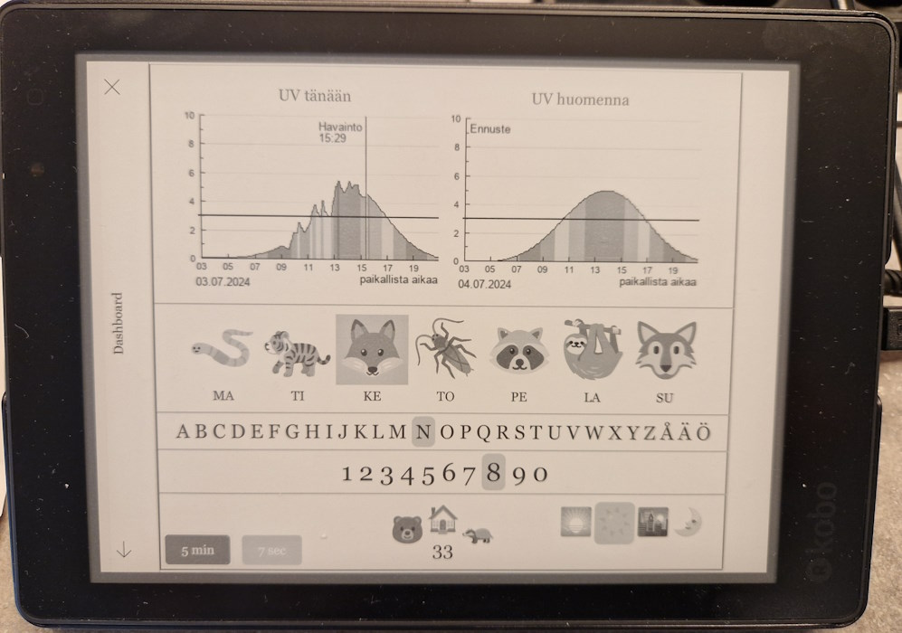

# Kobo Dashboard

A simple dashboard built with legacy web technologies for E-book readers with integrated browser.

Using an e-book reader compared to DIY solutions has the benefit of being an all-in-one package: Wi-Fi, touchscreen, 
browser, case.

## Example

I built the following dashboard for my children to see what weekday and time of day it is:



## Design

### Why so legacy technologies?

Unfortunately Kobo browser does not support newer web technologies. The website must be built using ES5 Javascript and 
CSS 2 (although supports vendor specific properties such as `-webkit-transform`).

Newer javascript would need build tooling to be supported. That might be added later, but so far keeping things simple 
has been preferred.

### Why all-in-one html?

To not require a build tool and avoid .js caching problems.

## Device Configuration

### Kobo Aura One

1. Connect your Kobo eReader to your computer
2. Navigate to `.kobo/Kobo` and open the file `Kobo eReader.conf`
3. Add the following options (with homepage as your dashboard hosting webpage)

```
[Browser]
homePage=https://yourdomain.com/yourdashboard

[FeatureSettings]
FullScreenBrowser=true
```

The following options may work in other devices, but not for Kobo Aura One:

```
[DeveloperSettings]
ForceAllowLandscape=true
```

4. Save the file then eject your Kobo eReader

> **NOTE:** Line-endings must be LF. Make sure that DeveloperSettings, FeatureSettings or Browser are not duplicated

## Alternatives

  * https://github.com/RolandColored/kobo-display
  * https://homey.app/en-us/blog/homey-ink/